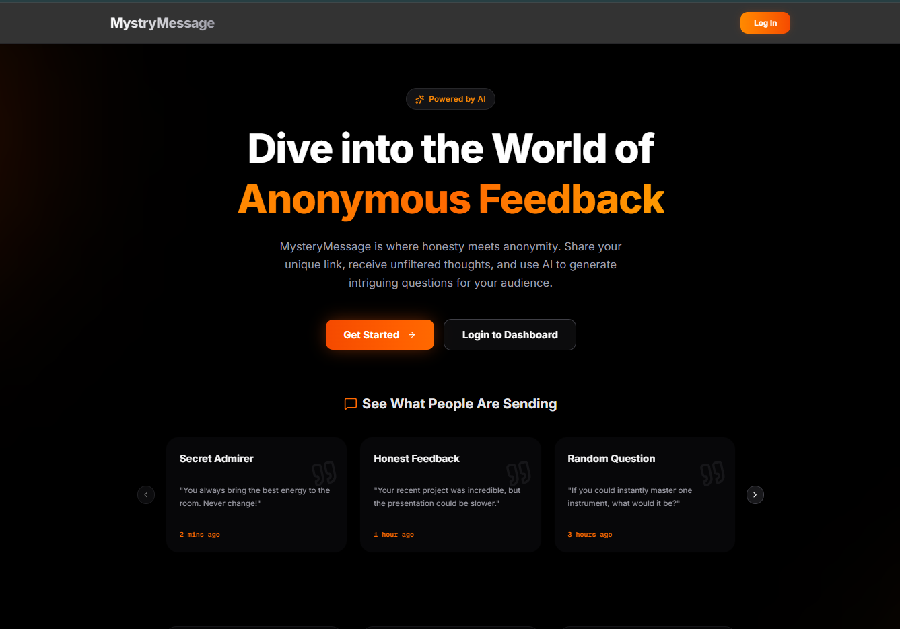
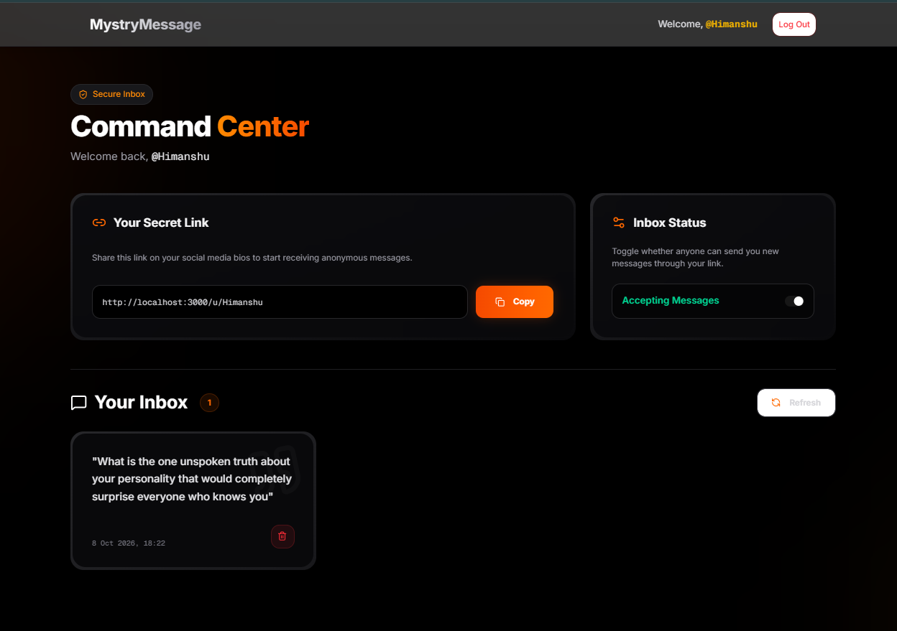
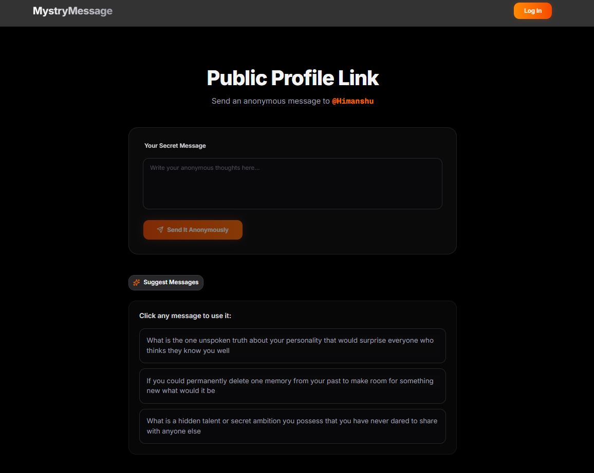

# 🕵️‍♂️ MysteryMessage 

**An elegant, secure, and AI-powered anonymous feedback platform.**

MysteryMessage allows users to create a unique profile link and receive honest, unfiltered, and anonymous messages from their audience. Built with a premium "Orange & Black" glassmorphism aesthetic, it features robust security, seamless dashboard controls, and AI-generated message suggestions to cure writer's block.

---

## 📸 Screenshots

### Home Page



### Command Center (Dashboard)



### Public Profile Link



---

## ✨ Features & How It Works

### The User Journey (Working Flow)
1. **Authentication:** Users sign up/login securely via NextAuth (Credentials Provider).
2. **Dashboard Management:** Upon login, users enter the "Command Center." Here, they get a unique shareable link (e.g., `domain.com/u/username`).
3. **Inbox Control:** A master switch allows users to toggle their inbox open or closed. If closed, the API completely blocks incoming messages.
4. **Receiving Feedback:** Visitors go to the public link and write a message. The sender is entirely anonymous.
5. **AI Suggestions:** If a visitor doesn't know what to ask, they click "Suggest Messages." The Gemini AI analyzes the username and generates 3 tailored, intriguing questions instantly.
6. **Message Management:** The account owner views messages on their dashboard and can permanently destroy them using a secure `$pull` operation in MongoDB.

---

## 🛠 Tech Stack

**Frontend**
*   **Framework:** Next.js (App Router)
*   **Styling:** Tailwind CSS
*   **UI Components:** Shadcn UI, Radix UI Primitive
*   **Form Handling:** React Hook Form
*   **Validation:** Zod
*   **Toast Notifications:** Sonner
*   **Icons:** Lucide React

**Backend & Database**
*   **Database:** MongoDB
*   **ODM:** Mongoose
*   **Authentication:** NextAuth.js (Secure Credentials)
*   **API Calls:** Axios

**Artificial Intelligence**
*   **Model:** Google Gemini
*   **Implementation:** Used to dynamically generate hyper-personalized, open-ended questions based on the target user's username. Includes an intelligent rate-limit fallback system to ensure uninterrupted UX even if API quotas are reached.

---

## 📂 Folder Structure

```text
mysterymessage/
├── src/
│   ├── app/
│   │   ├── (app)/               # Protected routes (Dashboard, Layout)
│   │   ├── (auth)/              # Authentication routes (Sign-in, Sign-up)
│   │   ├── api/                 # Next.js API Routes (Backend)
│   │   │   ├── accept-messages/ 
│   │   │   ├── auth/[...nextauth]/ 
│   │   │   ├── delete-message/[messageid]/
│   │   │   ├── get-messages/
│   │   │   ├── send-message/
│   │   │   └── suggest-messages/ # Gemini AI Route
│   │   ├── u/[username]/        # Public profile dynamic route
│   │   ├── globals.css          # Global Tailwind styles
│   │   ├── layout.tsx           # Root layout
│   │   └── page.tsx             # Landing Page
│   ├── components/              # Reusable UI components
│   │   ├── message_card/        # MessageCard component
│   │   └── ui/                  # Shadcn UI components
│   ├── lib/                     # Utilities (DB connection, etc.)
│   ├── model/                   # Mongoose schemas (User, Message)
│   ├── schemas/                 # Zod validation schemas
│   └── types/                   # TypeScript interfaces (APIResponse, etc.)
├── .env                         # Environment variables
├── next.config.ts               # Next.js configuration
├── tailwind.config.ts           # Tailwind configuration
└── package.json                 # Dependencies